# serena | iu

**Módulo:** 0488 · Desarrollo de interfaces
**Actividad:** jocarsa | iu mejorado · RA1
**Resultado de aprendizaje 1:** Genera interfaces gráficos de usuario mediante editores visuales utilizando las funcionalidades del editor y adaptando el código generado.
**Alumna:** Serena Sania Esteve · DAM · TAME Formación

---

## 1. Punto de partida y objetivo

En clase construimos **jocarsa | iu**, una interfaz de gestión con:

- una cabecera,
- dos columnas (módulos y vistas) redimensionables y contraíbles,
- un escenario central con una tabla de clientes,
- datos cargados desde archivos JSON,
- una librería de componentes (formularios, login y toasts) repartida en varias páginas.

El código estaba organizado con clases (`DOM`, `FichaIU`, `ToastIU`, `GestorColumnas`, `AplicacionIU`) dentro del namespace `jocarsa.iu`.

El objetivo de esta actividad ha sido **analizar a fondo ese código, corregir sus fallos y evolucionarlo** hasta convertirlo en una aplicación propia, **serena | iu**, con mi identidad visual y muchas más funciones. Se ha mantenido lo que funcionaba bien: la lógica de profundidad por variables CSS, las columnas con separadores, la arquitectura orientada a objetos y los datos en JSON. El aspecto visual, en cambio, se ha rediseñado por completo con un estilo **«gota de agua»** (conocido como *glassmorphism* o *liquid glass*).

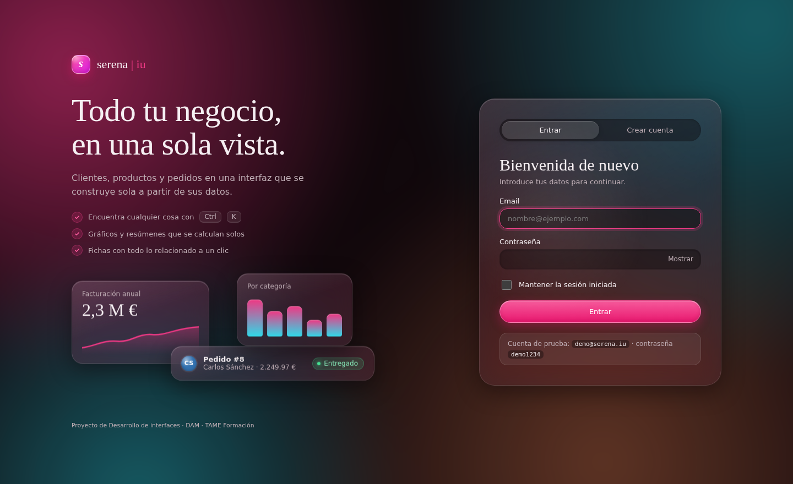

---

## a) Análisis de herramientas y librerías para generar interfaces gráficas

| Herramienta | Tipo | Plataforma | Ventajas | Inconvenientes |
|---|---|---|---|---|
| **DevTools de Chrome/Firefox** | Editor visual integrado | Web | Gratuito, edición en vivo del DOM y del CSS, editores de flexbox y grid, modo dispositivo | Los cambios no se guardan en el archivo |
| **Figma** | Diseño y prototipado | Web | Estándar del sector, colaborativo, inspecciona el CSS de cada elemento | No genera una aplicación funcional |
| **Pinegrow** | Editor visual web | HTML/CSS | Trabaja sobre archivos reales y genera HTML limpio | De pago |
| **Bootstrap Studio** | Editor visual web | Bootstrap | Arrastrar y soltar componentes | Atado a Bootstrap y de pago |
| **Qt Designer** | Editor visual de escritorio | Python (PyQt/PySide), C++ | Layouts potentes, genera `.ui` separado de la lógica | Curva de aprendizaje |
| **Scene Builder** | Editor visual de escritorio | JavaFX | Genera FXML separado del código | Solo JavaFX |
| **NetBeans GUI Builder** | Editor visual de escritorio | Java Swing | Integrado en el IDE | Código generado poco legible y bloqueado |
| **Android Studio Layout Editor** | Editor visual móvil | Android | Vista previa en varios dispositivos | Solo Android |

**Librerías** analizadas: React, Vue y Bootstrap (web); Tkinter y PyQt (Python); Swing y JavaFX (Java).

**Decisión.** Como la aplicación es web y el objetivo era entender el código a fondo, he trabajado con **HTML, CSS y JavaScript sin librerías**. Como editor visual he usado las **DevTools del navegador**. Una librería como React habría ocultado precisamente lo que había que analizar: cómo se genera el DOM, cómo se asocian los eventos y cómo se aplican los estilos.

---

## b) Creación de la interfaz con el editor visual

Proceso seguido:

1. Se parte del esqueleto de clase: `header`, `nav`, `.separador`, `section`, `.separador` y `.escenario`.
2. Con **DevTools → Elements** se inspecciona cada zona, se añaden y reordenan nodos en el árbol del DOM y se prueban textos.
3. En el panel **Styles** se prueban en vivo las nuevas variables de color (`--tono: 335` para el rosa, `--brillo: 13%` para el modo oscuro) y el desenfoque del cristal (`backdrop-filter: blur(22px) saturate(170%)`) y se ve cómo cambia toda la interfaz a la vez.
4. Los valores validados se trasladan a `css/estilo.css`.

> 📸 *Captura propia: DevTools con el panel Elements abierto sobre `index.html`.*

---

## c) Uso de las funciones del editor para ubicar los componentes

- **Editor de flexbox** (icono junto a `display:flex`): distribución de la cabecera en tres zonas (marca, herramientas y usuario) con `flex:1 / 2 / 1`, y alineación de las fichas dentro de cada columna.
- **Superposición de flexbox** en `main.cuerpo`: comprobar que las columnas tienen `flex:none` y que el escenario ocupa el resto con `flex:1`.
- **Superposición de grid**: ajuste de `.form-rejilla` (dos columnas) y `.rejilla` (tarjetas con `auto-fit`).
- **Modo dispositivo** (Ctrl+Shift+M): se definen dos puntos de ruptura. A 900 px, el formulario pasa a una columna y se oculta el nombre del usuario. A 700 px, las columnas quedan siempre contraídas mostrando solo las fichas.

> 📸 *Captura propia: editor de flexbox sobre el `header`.*
> 📸 *Captura propia: superposición de grid sobre el formulario.*

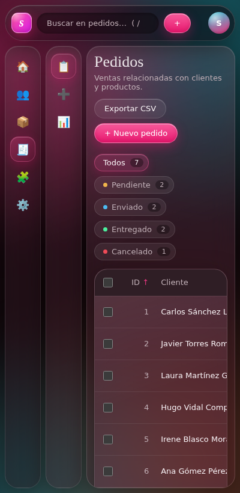

---

## d) Modificación de las propiedades de los componentes

| Componente | En jocarsa \| iu | En serena \| iu |
|---|---|---|
| Estilo | Chaflanes y superficies opacas | **Gota de agua**: cristal translúcido con `backdrop-filter`, formas redondeadas, reflejos de luz y fondo de manchas de color en movimiento |
| Paleta | Azul (`--tono:200`), 4 niveles opacos | Rosa (`--tono:335`), **5 capas de cristal** (color + transparencia) + `--acento` para lo interactivo |
| Tipografía | Ubuntu (con `@import` que no cargaba) | Playfair Display en títulos y DM Sans en la interfaz |
| Modo | Solo uno | **Oscuro y claro**, cambiando solo `--brillo` |
| Fichas | Cuadrados achaflanados con la inicial | **Gotitas circulares** con reflejo; **emoji** si el JSON lo trae |
| Logo | Imagen externa | **Monograma** en un cuadrado redondeado de cristal, dibujado solo con CSS (degradado, reflejo y sombra interior) |
| Paneles | Columnas pegadas entre sí | **Paneles flotantes** separados, con el tirador del separador visible solo al pasar el ratón |
| Elemento activo | Atraviesa el separador | Una **gota de color** con brillo y sombra de acento |
| Colores | Muchos fijos (`#111`, `#ddd`, `white`, `#f1f1f1`…) | **Todos derivados de variables**, así que cambian con el tono |
| Tabla | Sin ordenación ni paginación | Ordenable, paginada, con selección, totales, **acciones fijas** a la derecha, **pastillas de color** para estados y categorías y **avatares con iniciales** |
| Login | Formulario sobre imagen de fondo | **Escaparate** con titular, ventajas y una vista previa flotante de la app, junto a la tarjeta de acceso |
| Botones de columna | Solo el icono | `aria-expanded` y `title` que cambian según el estado |
| Foco | Sin estilo | `:focus-visible` con el color de acento |

Desde **Ajustes → Apariencia** el propio usuario modifica las propiedades en vivo: tono, modo y paletas predefinidas.

**Cómo está hecho el estilo «gota de agua»**

- **Cristal.** Todos los paneles comparten una misma receta: fondo semitransparente, `backdrop-filter: blur(22px) saturate(170%)` para desenfocar lo que hay detrás, un borde blanco muy tenue y una sombra interior de 1 px arriba (`inset 0 1px 0`) que imita el reflejo de la luz en el borde de una gota.
- **Profundidad.** Se conserva la regla de clase, pero ahora cada nivel es una capa de cristal: la cabecera (`--color0`) es la más oscura y opaca, y las tarjetas (`--color4`) las más claras. Al superponerse, las capas interiores se ven más luminosas.
- **Fondo vivo.** `body::before` pinta cuatro `radial-gradient` (rosa, aguamarina y lila) difuminados con `filter: blur(40px)`, que se desplazan despacio con una animación de 38 s. Los colores secundarios se calculan desde el tono: `calc(var(--tono) - 150)`. Por eso, al cambiar el tono, todo el fondo cambia en armonía.
- **Volumen.** Las fichas, el avatar y el botón principal llevan un `radial-gradient` blanco arriba a la izquierda y una sombra interior abajo, que les da aspecto de gota.
- **Legibilidad.** Las partes fijas de la tabla (cabecera y columna de acciones) usan un color opaco (`--opaco-tabla`). Si fueran de cristal, el texto que pasa por detrás al hacer scroll se mezclaría con el de delante.
- **Microinteracciones.** Las tarjetas tienen un foco de luz que sigue al ratón (un solo listener de `pointermove` escribe la posición en `--mx` y `--my`, y el CSS dibuja un `radial-gradient` en ese punto). Al pasar el ratón, un destello recorre el botón principal. Al cambiar de vista, el contenido entra con una única animación escalonada.
- **Carga.** Mientras llegan los JSON se muestra un esqueleto de tarjetas con un brillo animado, en lugar de una pantalla vacía.
- **Compatibilidad.** Con `@supports not (backdrop-filter: …)`, los navegadores que no soportan el desenfoque reciben capas casi opacas, para que el texto siempre se lea. Con `prefers-reduced-motion`, el fondo deja de moverse.

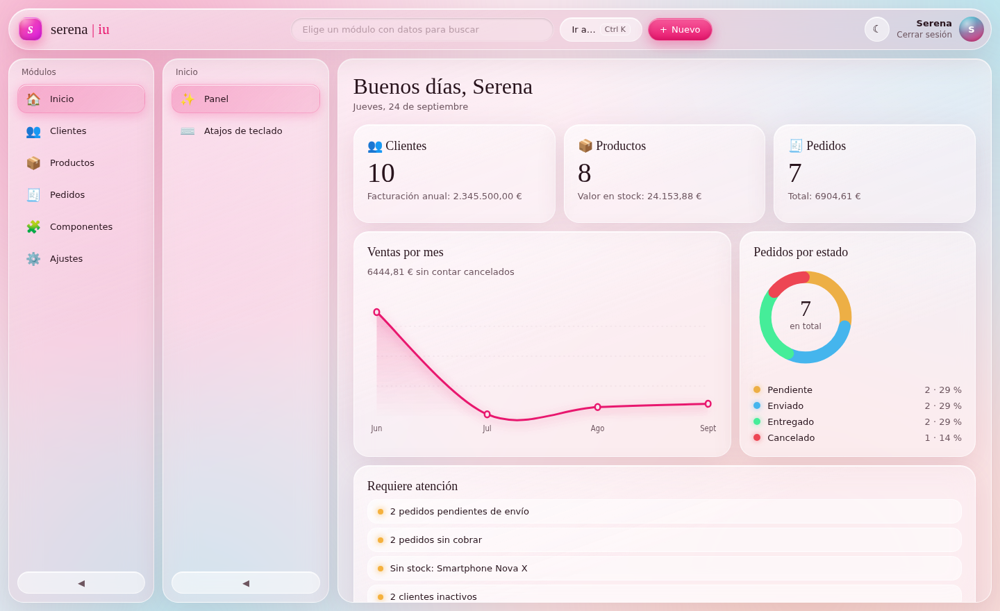

---

## e) Análisis del código de partida

Se revisaron todos los archivos de clase. Estos son los problemas encontrados:

**CSS (`estilo.css`)**

1. El `@import` de la fuente estaba en mitad del archivo. Un `@import` solo es válido al principio, así que el navegador lo ignoraba y la fuente Ubuntu solo se veía en equipos que la tenían instalada.
2. Había capas de versiones (010, V3, V4, V5) que se pisaban entre sí. Por ejemplo, `.minimizar` estaba definido dos veces, `.ficha` pasaba de círculo a cuadrado con `!important`, `.compacto` medía 58 px y luego 52 px, y `.ju-login-page` aparecía tres veces.
3. Colores escritos a mano que no respetaban el sistema de variables.

**JavaScript (`componentes.js` y `demo-ui.js`)**

4. `datos.json` se cargaba pero nunca se usaba: el formulario estaba escrito a mano.
5. Los emojis de los JSON de menú nunca se mostraban.
6. Pulsar cualquier módulo mostraba siempre la tabla de clientes, y `productos.json` no se cargaba en ningún sitio.
7. El `activo` del JSON de vistas se ignoraba: la selección inicial era `"Listado"`, un valor que no existía.
8. `Escape` volvía a la tabla, pero dejaba resaltada la vista anterior.
9. El buscador sacaba al usuario de cualquier vista.
10. `ToastIU` y `ToastDemo` eran casi el mismo código duplicado.
11. Los toasts se construían con `innerHTML` interpolando texto, sin `role="status"`.
12. Si faltaba la plantilla `#tpl-fila` o era incorrecta, el error lo recogía el `catch` de carga y mostraba "No se pudieron cargar los orígenes de datos", un mensaje engañoso.

**HTML**

13. `formularios.html` y `toasts.html` repetían la cabecera y las columnas completas, con fichas de colores fijos y sin marcar el módulo activo.
14. En `login.html` los campos no tenían `name` ni `autocomplete`, había enlaces vacíos y no existía registro.
15. `data-left` en los separadores no se usaba.

**Datos**

16. Los dos JSON de clientes tenían formatos distintos (`columnas/campo/registros` frente a `campos/nombre/datos`).
17. En productos, `stock: 0` y `disponible: false` decían casi lo mismo y podían contradecirse.
18. El precio (`749.99`) no se podía editar con `input type="number"`, porque el `step` por defecto es 1.

---

## f) Modificación del código

Cada problema del apartado anterior tiene su solución.

| # | Solución aplicada |
|---|---|
| 1 | `@import` movido a la primera línea |
| 2 | **Hoja única reescrita**, ordenada en 13 secciones y sin capas que se pisen. Solo quedan `!important` donde de verdad hacen falta (estado compacto y responsive) |
| 3 | Todos los colores salen de `--tono`, `--saturacion`, `--brillo` y `--escalon` |
| 4 | `FormularioIU` genera cualquier formulario desde `campos` |
| 5 | `FichaIU.completar(elemento, texto, emoji)` |
| 6 | Cada módulo apunta a su propio JSON con `origen`, y la clase `Entidad` hace funcionar cualquiera de ellos |
| 7 y 8 | **Enrutador por URL** (`#/modulo/vista/id`): el elemento activo se deduce siempre de la dirección, así que no puede desincronizarse |
| 9 | El buscador filtra el módulo actual y solo cambia de vista si hace falta |
| 10 | Una sola clase `ToastIU` en `nucleo.js`, compartida por todas las páginas |
| 11 | Toasts creados desde `<template id="tpl-toast">` con `textContent` y `role="status"` |
| 12 | `DOM.plantilla(id)` lanza un error claro si falta una plantilla: *"Falta la plantilla #tpl-fila en el HTML"* |
| 13 | Las demos pasan a ser vistas de la aplicación (**Componentes**): se elimina todo el HTML duplicado |
| 14 | Login con `name`, `autocomplete`, pestaña de **registro**, mostrar contraseña y medidor de fuerza |
| 15 | Eliminado. El separador ahora es accesible (`role="separator"`, `tabindex`, flechas del teclado) |
| 16 | **Formato único** para todos los esquemas: `titulo`, `singular`, `campos` y `datos` |
| 17 | Se cambia a `descatalogado`, que significa otra cosa que no tener stock |
| 18 | Propiedad `paso: 0.01` en el esquema, que se aplica como `step` |

Además, los esquemas JSON se han ampliado con propiedades nuevas que la interfaz interpreta sola:

```json
{ "nombre": "total", "tipo": "number", "formato": "moneda", "paso": 0.01,
  "calculo": { "cantidad": "unidades", "referencia": "producto", "origen": "productos", "precio": "precio" },
  "soloLectura": true }
```

| Propiedad | Efecto |
|---|---|
| `requerido`, `min`, `patron`, `paso` | Validación del formulario |
| `listado` | Qué columnas se ven en la tabla |
| `formato: "moneda"` | Muestra `42.000,00 €` y suma la columna en el pie |
| `defecto` (`"hoy"` para fechas) | Valor inicial en los registros nuevos |
| `origen` + `mostrar` | **Relación entre entidades**: el cliente de un pedido se elige entre los clientes reales |
| `calculo` | El total del pedido se calcula solo: unidades × precio del producto |
| `agregado: "media"` | En el resumen se muestra la media en lugar de la suma (el precio no se suma) |
| `colores` | Tono de cada opción: se muestra como pastilla en la tabla, en la ficha, en los filtros y en los gráficos |
| `filtroRapido` | Campo por el que se generan los filtros con contador encima de la tabla |
| `avatar` | Campos con los que se generan las iniciales del avatar |

**Estructura final del proyecto**

```
serena-iu/
├── index.html          aplicación y plantillas
├── login.html          acceso y registro
├── css/estilo.css      hoja única
├── js/nucleo.js        DOM, Utilidades, Almacen, TemaIU, Sesion, ToastIU, DialogoIU
├── js/aplicacion.js    Entidad, FichaIU, Enrutador, GestorColumnas, TablaIU,
│                       FormularioIU, ResumenIU, PaletaIU, AplicacionIU
├── js/acceso.js        AccesoIU
└── data/               menu, vistas, clientes, productos, pedidos (.json)
```

El namespace pasa de `jocarsa.iu` a `serena.iu`. Como antes, se usa un punto porque JavaScript no admite `|` en un identificador.

---

## g) Asociación de eventos a acciones

| Elemento | Evento | Acción |
|---|---|---|
| Ventana | `hashchange` | Pinta la vista que indica la URL (atrás y adelante del navegador funcionan) |
| Ventana | `beforeunload` | Avisa si se cierra la pestaña con un formulario a medias |
| Documento | `keydown` | Atajos: **Ctrl+K** abre la paleta, **/** el buscador, **N** crea un registro, **?** muestra los atajos y **Escape** vuelve al listado |
| Buscador | `input` (con espera de 150 ms) | Filtra la tabla ignorando mayúsculas y tildes ("autonomo" encuentra "Autónomo") |
| Buscador | `keydown` Escape | Limpia la búsqueda |
| Cabeceras de tabla | `click` / `keydown` Enter | Ordena ascendente o descendente |
| Tabla | `click` delegado | Editar o borrar con los botones; pulsar el resto de la fila abre la **ficha de detalle** |
| Filtros rápidos | `click` | Filtran la tabla por estado o categoría |
| Ficha de detalle | `keydown` (Escape y Tab) | Se cierra con Escape y mantiene el foco dentro mientras está abierta |
| Tarjetas | `pointermove` (un solo listener) | Mueven el foco de luz |
| Tabla | `dblclick` | Editar la fila |
| Tabla | `change` delegado | Seleccionar filas o toda la página |
| Formulario | `input` | Marca cambios sin guardar y revalida el campo tras el primer intento |
| Formulario | `focusout` | Valida el campo al salir de él |
| Formulario | `submit` | Valida todo, enfoca el primer error y guarda |
| Producto o unidades | `change` / `input` | Recalcula el total del pedido |
| Toast | `mouseenter` / `mouseleave` | Pausa y reanuda el autocierre |
| Toast | `click` en «Deshacer» | Recupera los registros borrados en su posición original |
| Diálogo | `cancel` (Escape) | Se cierra devolviendo `false` |
| Botón minimizar | `click` | Contrae o expande la columna y lo recuerda |
| Separador | `pointerdown`/`pointermove`/`pointerup` | Redimensiona la columna |
| Separador | `keydown` flechas | Redimensiona con el teclado |
| Separador | `dblclick` | Recupera el ancho por defecto |
| Vista de la columna | `dragstart` / `dragend` | Empieza a arrastrarla |
| Escenario | `dragover` / `dragleave` / `drop` | Abre la vista soltada |
| Paleta | `input` / `keydown` flechas y Enter | Filtra y ejecuta comandos |
| Apariencia | `input` (rango) / `click` | Cambia el tono, el modo o la paleta |
| Importar | `change` en `input type=file` | Restaura una copia de seguridad |

**Delegación de eventos.** La tabla tiene un único listener para todas sus filas, así que las filas nuevas funcionan sin registrar nada más:

```js
tabla.addEventListener("click", (evento) => {
	const boton = evento.target.closest("button[data-accion]");
	const fila = evento.target.closest("tr[data-id]");
	if (!boton || !fila) { return; }
	if (boton.dataset.accion === "borrar") { this.app.borrarRegistros(entidad, [Number(fila.dataset.id)]); }
});
```

**Promesas en los diálogos.** `DialogoIU.confirmar()` sustituye a `confirm()` y devuelve una promesa, así que se usa con `await`:

```js
const confirmado = await DialogoIU.confirmar({ titulo: "¿Borrar este cliente?", aceptar: "Borrar", peligro: true });
```

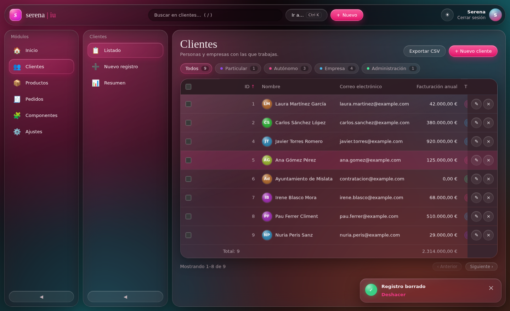

---

## h) Aplicación desarrollada

**serena | iu** es una aplicación completa de gestión de clientes, productos y pedidos.

- **Acceso con login y registro.** Las contraseñas se guardan cifradas con SHA-256 y se puede mantener la sesión iniciada.
- **Panel de inicio** con saludo, cifras de cada módulo y avisos de lo que requiere atención: pedidos pendientes o sin cobrar, productos sin stock y clientes inactivos.
- **CRUD genérico**: el mismo código gestiona las tres entidades, porque todo se genera desde el esquema JSON.
- **Ficha lateral de detalle**: al pulsar una fila se abre un panel con todos los datos y los **registros relacionados**. Por ejemplo, un cliente muestra sus pedidos y el total gastado, y un producto muestra quién lo ha comprado. Las relaciones se deducen solas de los campos con `origen`.
- **Gráficos SVG hechos a mano**, sin librerías: ventas por mes (curva suave de Catmull-Rom convertida a Bézier, que se dibuja con animación) y un donut de pedidos por estado con leyenda.
- **Filtros rápidos** con contador (Pendiente 2, Enviado 2…) y **pastillas de color** para estados y categorías.
- **Tablas** con búsqueda, ordenación, paginación, selección múltiple, totales y exportación a CSV compatible con Excel.
- **Formularios** con validación y mensajes en español, valores por defecto, relaciones entre entidades y campos calculados.
- **Borrado con deshacer**, y aviso al salir con cambios sin guardar.
- **Resumen** de cada módulo con cifras animadas y gráficos de barras.
- **Paleta de comandos** (Ctrl+K) para ir a cualquier vista, acción o registro.
- **Estilo «gota de agua»**: paneles de cristal sobre un fondo de color vivo, en modo oscuro y claro.
- **Apariencia personalizable**: tono, modo claro u oscuro y paletas predefinidas.
- **Persistencia** en `localStorage`: datos, tema, ancho de columnas y columnas contraídas. Incluye **copia de seguridad** para exportar e importar en JSON.
- **Accesibilidad**: todo es usable con teclado, con roles ARIA, `aria-sort`, `aria-current`, foco visible y respeto a `prefers-reduced-motion`.
- **Responsive** desde móvil hasta escritorio.

| | |
|---|---|
| 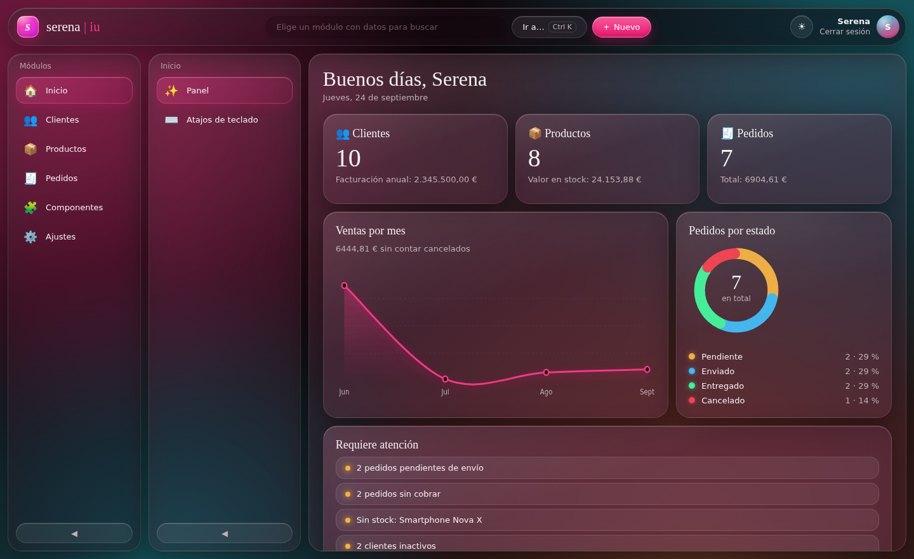 | 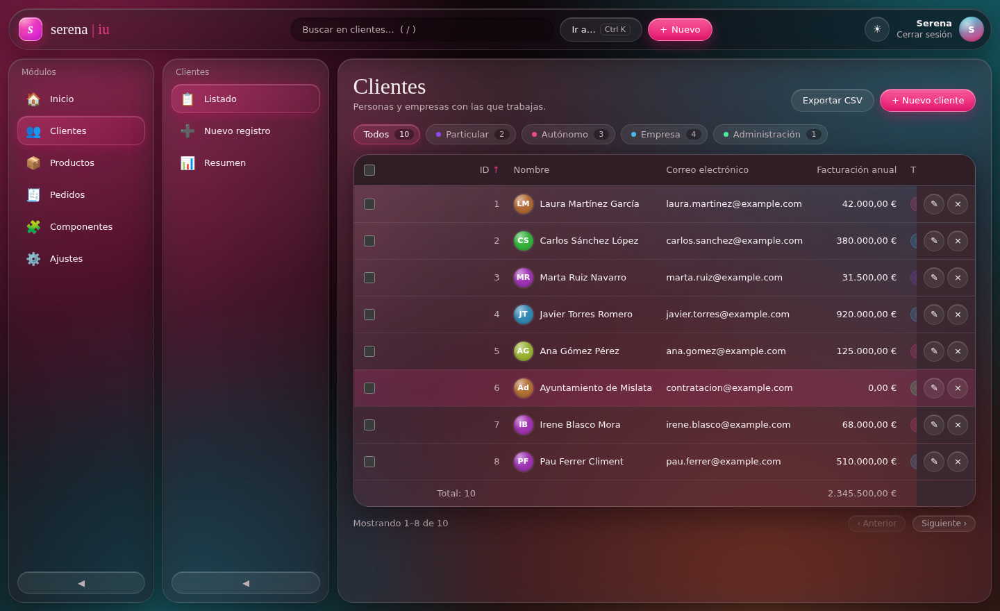 |
| 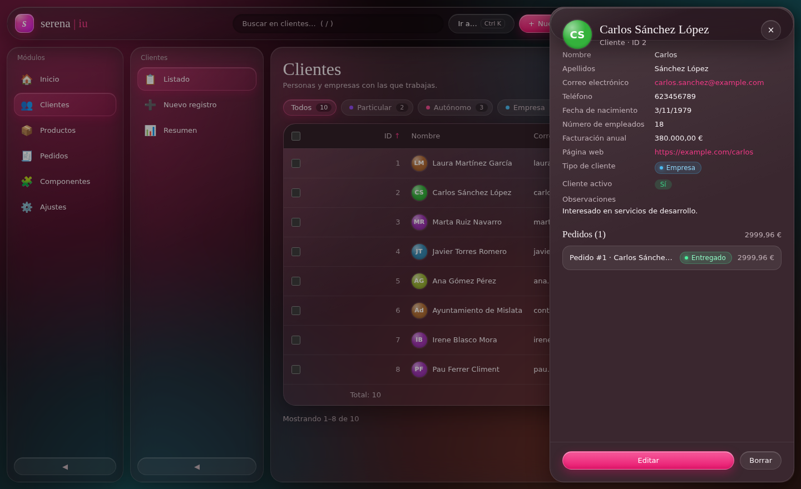 | 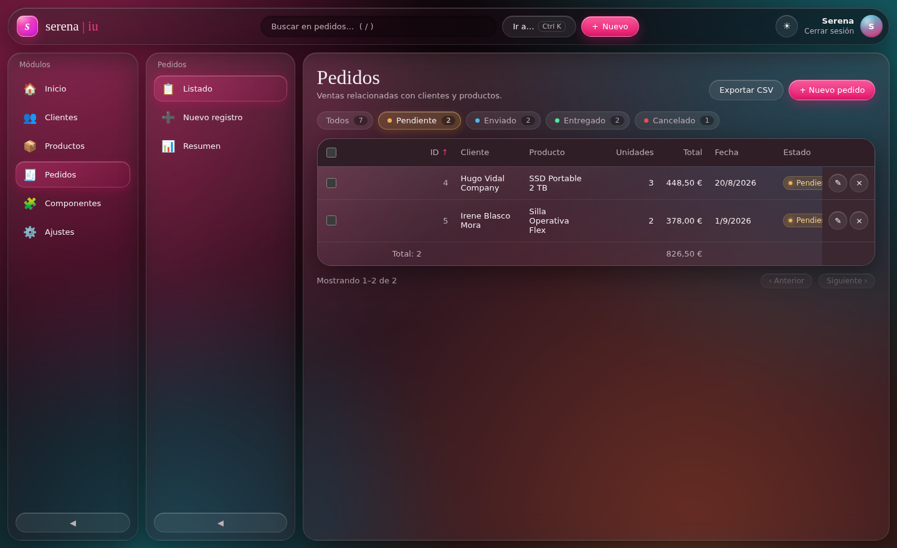 |
| 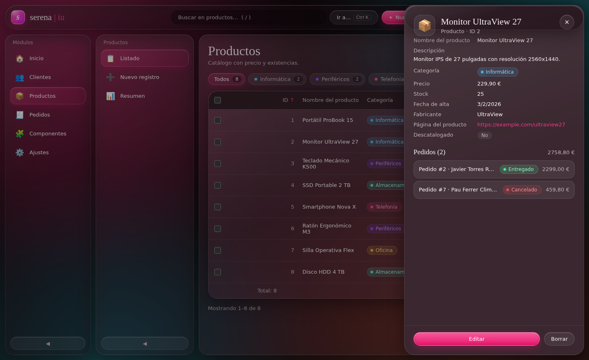 | 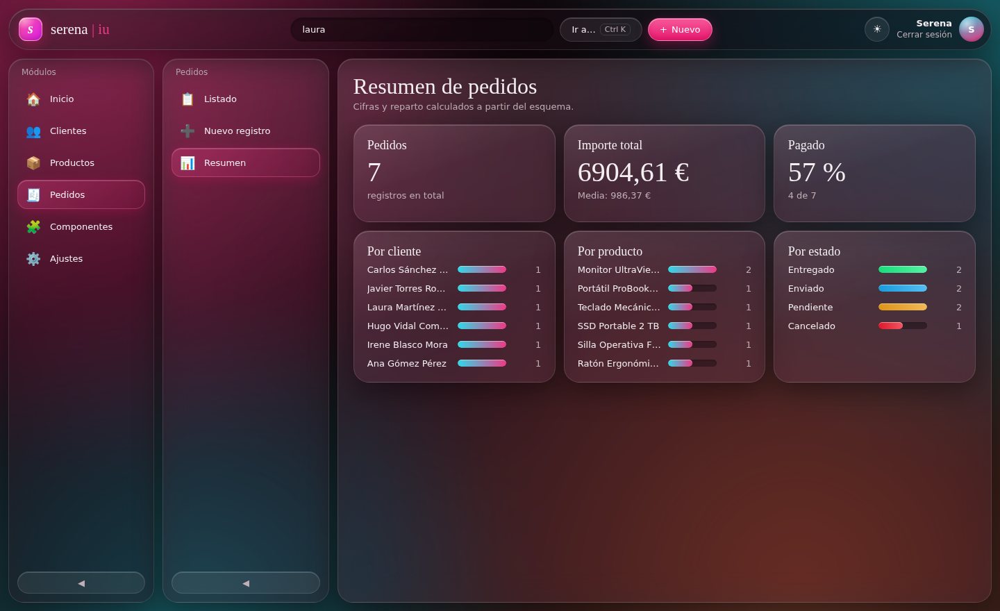 |
|  | 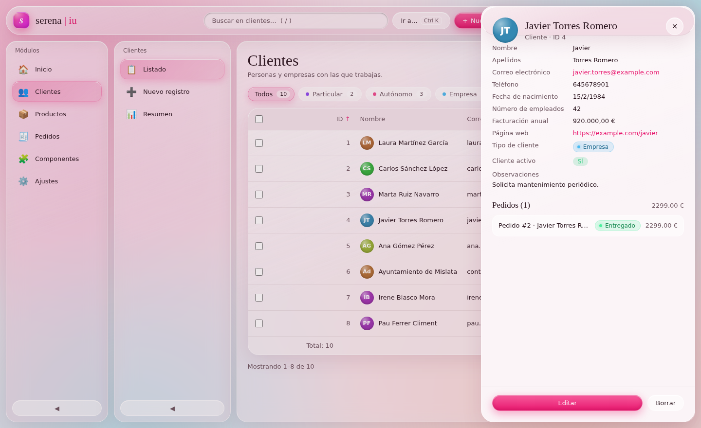 |
|  |  |

**Cómo ejecutarla**

```bash
cd serena-iu
python3 -m http.server 8000
```

Después hay que abrir `http://localhost:8000` en el navegador. Hace falta un servidor porque el navegador bloquea `fetch` cuando se abre el archivo con doble clic.

Cuenta de prueba: `demo@serena.iu` · contraseña `demo1234` (también se puede crear una cuenta nueva).

**Limitación conocida.** El login es una simulación en el navegador para practicar el flujo de la interfaz. En una aplicación real, los usuarios y la validación de contraseñas irían en el servidor, por ejemplo con Flask y SQLite.

---

## Conclusión

El editor visual del navegador es muy útil para colocar y ajustar componentes, porque cada cambio se ve al instante. Pero el valor de esta actividad ha estado en **analizar el código generado y adaptarlo**.

Al revisarlo aparecieron fallos que no se veían a simple vista: un `@import` ignorado, datos que se cargaban sin usarse, plantillas que rompían la tabla y estados que se desincronizaban. La mejora principal ha sido cambiar el enfoque: en lugar de escribir cada pantalla a mano, **la interfaz se genera a partir de la descripción de los datos**. Por eso añadir un módulo nuevo solo exige crear su JSON y añadir una línea en `menu.json`.
